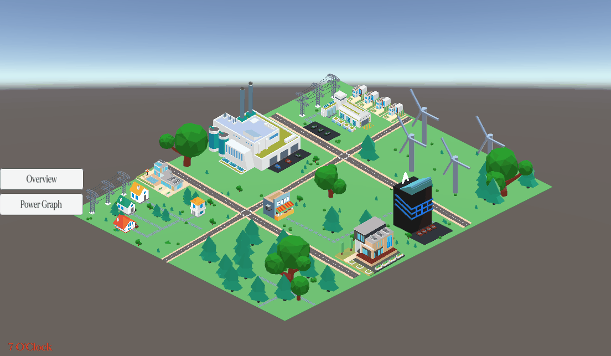

# Energy-Simulation

**The simulation has been released, and can be accessed by downloading it from**

# https://masstortorogamer.itch.io/green-energy-simulation

## Password: genergy100

## Update 1.0.1

Added a Snow Storm for the economy, the Player can now only gain Energy Coins(EC for short) during Snow Storms if they contribute their upgrades for the community, EC increases depending on how many upgrades were selected.

The Player can click on the Factory to get a small text of information about what it does, and what can be done to reduce air pollution.

## Update 1.0.2

The Ground now gets covered in snow when the Snow Storm happens.

Took me a while to get it done due to trying different techniques.

## Update 1.0.3

Added an Electric Utility Building into the game, currently it only provides general information about what it does when clicked on.

Day Cycle has been added, you'll be able to see the shadows of buildings and the ever changing cycle visually.

Trees and Bushes were added, to make the world a bit more lively. (Free Asset)

Added a space between the text at the end of the period for The Factory Information.

## Update 1.0.3.1

Made sure the UI scales with the screen size to avoid inconvenient UI size/position.

Update 1.0.3.2

By clicking on the Atom Energy Utilities Building, you can see the total amount of Energy Coins that was distributed to the community.

## Update 1.0.3.3

By clicking on the Factory, you can see the amount of Pollution the factory causes by percentage, it can be decreased by applying upgrades to your home, the AI will also contribute to this.

However, the pollution cannot go below 10% since it still has to send power to things other than your house.

Also renamed the Cleanliness value inside FactoryScript to Pollution to better represent itself.

## Update 1.0.3.4

Now when the Player first starts the game, the game will ask the Player if they wish to build their house when they click on an empty spot.

## Update 1.0.4

Addead a Windmill Farm that allows the Player to purchase Green Energy for their home. (Currently affects all other houses)

An Energy Graph was added to the game, this will show Player's or AI's power consumption for the day.

The Energy Graph will change every hour, every hour is a second in game.

It will reset at Midnight(24).

Sun Generators will provide 10% Green Energy during Day time. Between 6 and 18.

Energy Coins changed to Reward Coins, and Total amount of earned coins can be seen in Overview.

Removed the Timed weather alarm and took out Snowstorm for now.

## Update 2.0.0

**THE GAME IS NOW IN ISOMETRIC PERSPECTIVE.**

Improved/Changed the graphics to look like Isometric.

Reduced the amount of houses and removed their building point.

The Player now controls the Red House.

Other houses near the Red House can be clicked on to show their Energy Consumption Graph.

Improved panels and added images to represent some buttons.

Reduced the amount of houses, and removed their building spots.

Added a lot more environmental decorations for the game.

Purchasing energy from the windmill farm will only affect the Player, AI will purchase their own energy.

TO-DO

Provide a Tutorial.

Make it clear of what you're clicking on.

Make the environment more lively (Add Birds.)
